# 特点
```
(1) 简单易用，零学习成本
(2) 支持多种数据类型
(3) 支持Excel多行注释
(4) 强大的输入容错性
(5) 定位到单元格的错误提醒，更快的找出非法的输入
(6) 提供模板文件，可自定义输出的代码文件
(7) 支持文件缓存，提升导出速度
(8) 支持16进制输入
```
# 如何使用
命令行
```
ExcelToCode.exe
-excel_path     Excel文件根目录[必填]
-code_path      代码文件导出目录[必填]
-data_path      数据文件导出目录[必填]
-cache_path     缓存文件存放目录[选填]
-template_path  模板文件目录[选填]
-data_suffix    数据文件后缀[选填]
```

准备好按格式填写好的Excel文件  
  
执行以下命令行即可在当前目录下生成Code和Data这两个文件夹，包含着代码文件和数据文件。
```
ExcelToCode.exe -excel_path ./Excel -code_path ./Code -data_path ./Data
```
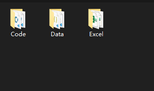  
1个Excel导出1个代码文件和1个数据文件。  
除了Excel导出的代码文件，还会额外导出一个Table.cs的代码文件
使用Table.cs来加载数据文件并使用。  
例如UserInfo表  
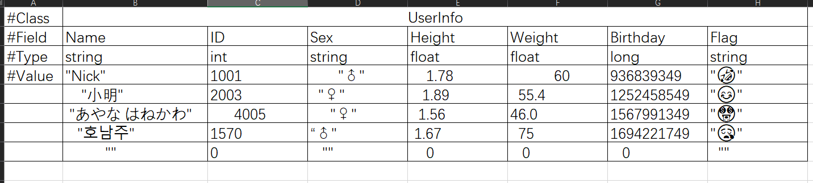  
导出的代码文件为`UserInfo.cs`  
```C#
using System.Collections.Generic;
using Newtonsoft.Json;

namespace Feif
{
    [JsonObject(MemberSerialization.OptIn)]
    public class UserInfo
    {
        [JsonRequired] public string Name;
        [JsonRequired] public int ID;
        [JsonRequired] public string Sex;
        [JsonRequired] public float Height;
        [JsonRequired] public float Weight;
        [JsonRequired] public long Birthday;
        [JsonRequired] public string Flag;
    }
}
```
数据文件为`UserInfo.json`  
将导出的代码文件和数据文件复制到项目工程中   
通过Table.Load函数加载数据文件，加载完成后就可以直接使用Table中数据
```C#
// 加载数据文件
Table.Load(File.ReadAllBytes("UserInfo.json"));
// 使用
var userInfos = Table.UserInfo;
foreach (var item in userInfos)
{
    Console.WriteLine($"{item.ID} {item.Name} {item.Sex}");
}
```
# Excel填写要求
  
```
(1) 第一行以#Class开头，后面接类名
(2) 第二行以#Field开头，后面接字段名
(3) 第三行以#Type开头，后面接类型
(4) 第四行以#Value开头，当前行和后面行填上数据
(5) 字符串类型必须写在""之间 ，且可使用转义字符\r \n \t \\ \" 等等
(6) 数组类型的分隔符为|。
(7) 字典类型的分隔符为:和|，:用来分隔key和value，|用来分隔不同的key-value
(8) 单元格不能为空，空字符串用""表示。
(9) byte,short,int,long,sbyte,ushort,uint,ulong支持16进制输入
```
以下是符合要求的填写示例，可参考源码文件中的Example  
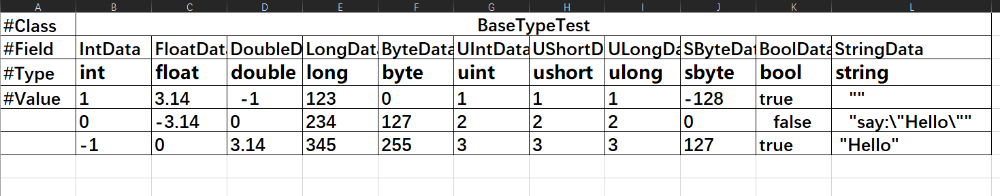  
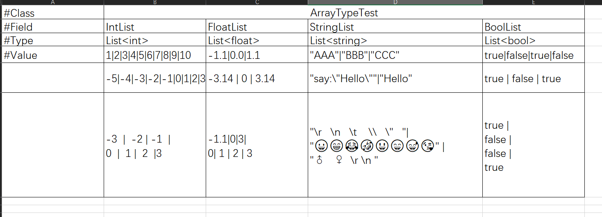  
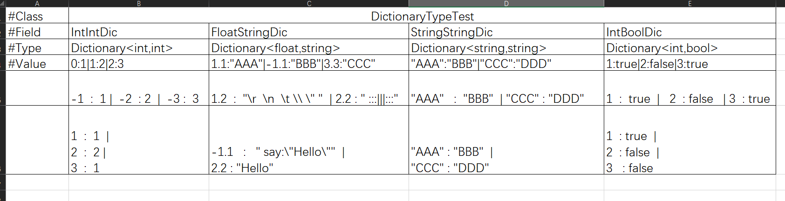  
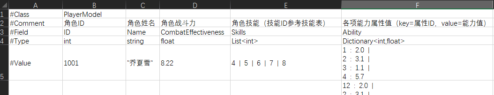  
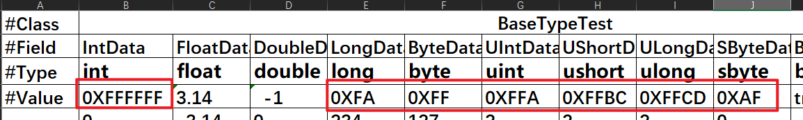  
# 命名空间
(1) 支持在Excel中填写命名空间，导出的代码文件会包含填写的命名空间   
(2) 可在ExcelToCode程序目中找到`setting.json`修改`DefaultNamespace`即可更改默认的命名空间  
例如：#Class后填写Game.PlayerModel  
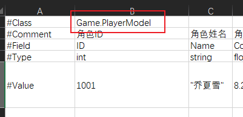  
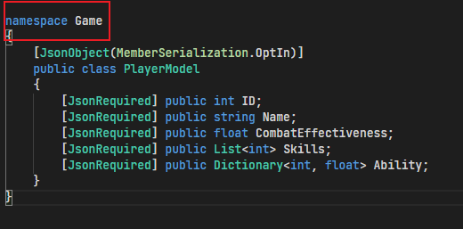  
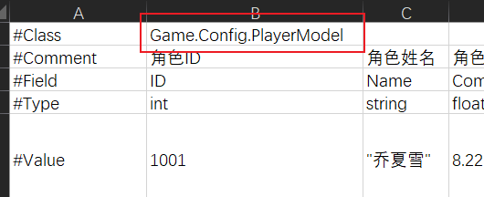  
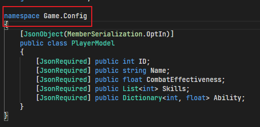  

# 模板文件
```
使用-template_path来指定模板文件目录，不填将使用默认的模板文件。
默认模板文件在ExcelToCode程序文件夹下的Template。
分别为
(1)DataTemplate.txt
(2)DataFieldTemplate.txt
(3)TableTemplate.txt
(4)TableFieldTemplate.txt
替换的关键字有 #NAMESPACE# #PROPERTIES# #CLASS# #TYPE# #NAME#
注意：TableTemplate.txt模板文件的第一行要制定输出的文件名称。#FILENAME=Table#，将输出Table.cs。  
```

# 支持的数据类型
11 + 11 + 11 + 11 * 11 = 154  
11个基础类型 + 11个基础类型对应的数组类型 + 11个基础类型对应的集合类型 + 11个基础类型相互组合的字典类型 = 154  
其他类型不支持，如：自定义类型、`List<List<int>>`、`Dictionary<int,List<float>>`等
```
 int 
 float 
 double 
 long 
 byte 
 bool 
 uint 
 ushort 
 ulong 
 sbyte 
 string 
 
 List<int> 
 List<float> 
 List<double> 
 List<long> 
 List<byte> 
 List<bool> 
 List<uint> 
 List<ushort> 
 List<ulong> 
 List<sbyte> 
 List<string> 

 HashSet<int> 
 HashSet<float> 
 HashSet<double> 
 HashSet<long> 
 HashSet<byte> 
 HashSet<bool> 
 HashSet<uint> 
 HashSet<ushort> 
 HashSet<ulong> 
 HashSet<sbyte> 
 HashSet<string> 

 Dictionary<int,int> 
 Dictionary<int,float> 
 Dictionary<int,double> 
 Dictionary<int,long> 
 Dictionary<int,byte> 
 Dictionary<int,bool> 
 Dictionary<int,uint> 
 Dictionary<int,ushort> 
 Dictionary<int,ulong> 
 Dictionary<int,sbyte> 
 Dictionary<int,string> 
 Dictionary<float,int> 
 Dictionary<float,float> 
 Dictionary<float,double> 
 Dictionary<float,long> 
 Dictionary<float,byte> 
 Dictionary<float,bool> 
 Dictionary<float,uint> 
 Dictionary<float,ushort> 
 Dictionary<float,ulong> 
 Dictionary<float,sbyte> 
 Dictionary<float,string> 
 Dictionary<double,int> 
 Dictionary<double,float> 
 Dictionary<double,double> 
 Dictionary<double,long> 
 Dictionary<double,byte> 
 Dictionary<double,bool> 
 Dictionary<double,uint> 
 Dictionary<double,ushort> 
 Dictionary<double,ulong> 
 Dictionary<double,sbyte> 
 Dictionary<double,string> 
 Dictionary<long,int> 
 Dictionary<long,float> 
 Dictionary<long,double> 
 Dictionary<long,long> 
 Dictionary<long,byte> 
 Dictionary<long,bool> 
 Dictionary<long,uint> 
 Dictionary<long,ushort> 
 Dictionary<long,ulong> 
 Dictionary<long,sbyte> 
 Dictionary<long,string> 
 Dictionary<byte,int> 
 Dictionary<byte,float> 
 Dictionary<byte,double> 
 Dictionary<byte,long> 
 Dictionary<byte,byte> 
 Dictionary<byte,bool> 
 Dictionary<byte,uint> 
 Dictionary<byte,ushort> 
 Dictionary<byte,ulong> 
 Dictionary<byte,sbyte> 
 Dictionary<byte,string> 
 Dictionary<bool,int> 
 Dictionary<bool,float> 
 Dictionary<bool,double> 
 Dictionary<bool,long> 
 Dictionary<bool,byte> 
 Dictionary<bool,bool> 
 Dictionary<bool,uint> 
 Dictionary<bool,ushort> 
 Dictionary<bool,ulong> 
 Dictionary<bool,sbyte> 
 Dictionary<bool,string> 
 Dictionary<uint,int> 
 Dictionary<uint,float> 
 Dictionary<uint,double> 
 Dictionary<uint,long> 
 Dictionary<uint,byte> 
 Dictionary<uint,bool> 
 Dictionary<uint,uint> 
 Dictionary<uint,ushort> 
 Dictionary<uint,ulong> 
 Dictionary<uint,sbyte> 
 Dictionary<uint,string> 
 Dictionary<ushort,int> 
 Dictionary<ushort,float> 
 Dictionary<ushort,double> 
 Dictionary<ushort,long> 
 Dictionary<ushort,byte> 
 Dictionary<ushort,bool> 
 Dictionary<ushort,uint> 
 Dictionary<ushort,ushort> 
 Dictionary<ushort,ulong> 
 Dictionary<ushort,sbyte> 
 Dictionary<ushort,string> 
 Dictionary<ulong,int> 
 Dictionary<ulong,float> 
 Dictionary<ulong,double> 
 Dictionary<ulong,long> 
 Dictionary<ulong,byte> 
 Dictionary<ulong,bool> 
 Dictionary<ulong,uint> 
 Dictionary<ulong,ushort> 
 Dictionary<ulong,ulong> 
 Dictionary<ulong,sbyte> 
 Dictionary<ulong,string> 
 Dictionary<sbyte,int> 
 Dictionary<sbyte,float> 
 Dictionary<sbyte,double> 
 Dictionary<sbyte,long> 
 Dictionary<sbyte,byte> 
 Dictionary<sbyte,bool> 
 Dictionary<sbyte,uint> 
 Dictionary<sbyte,ushort> 
 Dictionary<sbyte,ulong> 
 Dictionary<sbyte,sbyte> 
 Dictionary<sbyte,string> 
 Dictionary<string,int> 
 Dictionary<string,float> 
 Dictionary<string,double> 
 Dictionary<string,long> 
 Dictionary<string,byte> 
 Dictionary<string,bool> 
 Dictionary<string,uint> 
 Dictionary<string,ushort> 
 Dictionary<string,ulong> 
 Dictionary<string,sbyte> 
 Dictionary<string,string> 
```